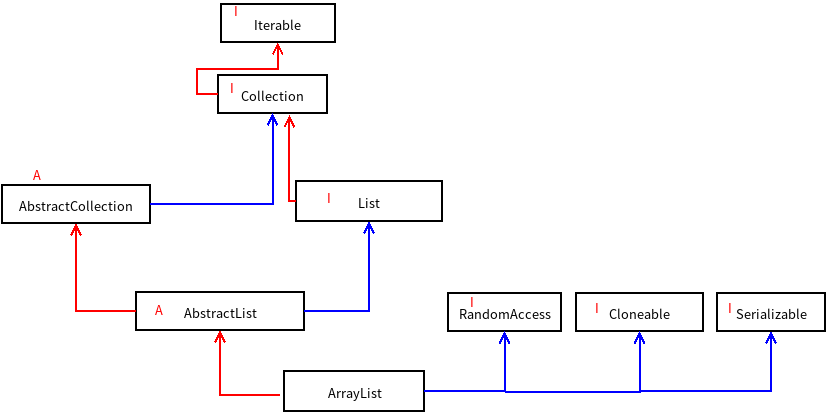

## ArrayList学习

List集合下常用的两个实现类是ArrayList和LinkedList，在[LinkedList](./LinkedList.md)中我们知道了LinkedList的内部是用双向链表实现的，而本文要说的ArrayList是用一个Object型的数组实现的。

1. ArrayList继承和实现类有哪些

   图中红色线代表的是继承关系，蓝色线代表的是实现关系，A表示这是一个抽象类，I表示这是一个接口

   

2. ArrayList中的成员变量和常量

   ```java
   private static final int DEFAULT_CAPACITY = 10;
   
   private static final Object[] EMPTY_ELEMENTDATA = {};
   
   private static final Object[] DEFAULTCAPACITY_EMPTY_ELEMENTDATA = {};
   
   transient Object[] elementData; // non-private to simplify nested class access
   
   private int size;
   ```

   源码里的注释有点多，注释我就没有复制过来，简单说一下这些成员变量和常量的作用。

   - DEFAULT_CAPACITY=10，这个常量表示的是ArrayList集合的容量，当我们用`new ArrayList<>();`来创建对象时，该集合在添加元素的时候，会默认将容量设置为10.
   - EMPTY_ELEMENTDATA={}，这个常量表示一个空数组
   - Object[] DEFAULTCAPACITY_EMPTY_ELEMENTDATA = {}，我们使用无参构造器创建ArrayList对象的时候，元素集合就默认等于这个值
   - Object[] elementData，上面已经介绍过，ArrayList底层使用数组实现的，这个elementData就是用来实现该集合的。
   - size，表示的是集合中元素个数

   下面来仔细其中的细节

3. 先来看构造器

   - 无参构造器

     ```java
     public ArrayList() {
         	this.elementData = DEFAULTCAPACITY_EMPTY_ELEMENTDATA;
     }
     ```

     当我们不指定任何的参数时，就指定`this.elementData = DEFAULTCAPACITY_EMPTY_ELEMENTDATA;`，可能有人会想，EMPTY_ELEMENTDATA和DEFAULTCAPACITY_EMPTY_ELEMENTDATA都是一个空的数组，用一个不就可以了吗，这个在初次添加元素的时候就体现出作用了。

   - 指定结合容量的有参构造器

     ```java
     public ArrayList(int initialCapacity) {
             if (initialCapacity > 0) {
                 	this.elementData = new Object[initialCapacity];
             } else if (initialCapacity == 0) {
                 	this.elementData = EMPTY_ELEMENTDATA;
             } else {
                 	throw new IllegalArgumentException("Illegal Capacity: "+
                                                    initialCapacity);
             }
     }
     ```

     注意initialCapacity == 0这个条件时，this.elementData = EMPTY_ELEMENTDATA;这段代码。因为集合在初始创建时都是空的，那么在第一次增加元素的时候，我们是不是要判断一下这个空的集合是我们创建时指定了容量为0创建的，还是使用无参构造器创建的呢。这两者在扩容时是不一样的。

   - 参数为一个集合的构造器

     ```java
     public ArrayList(Collection<? extends E> c) {
             elementData = c.toArray();
             if ((size = elementData.length) != 0) {
                     // c.toArray might (incorrectly) not return Object[] (see 6260652)
                     if (elementData.getClass() != Object[].class)
                      		elementData = Arrays.copyOf(elementData, size, Object[].class);
             } else {
                     // replace with empty array.
                     this.elementData = EMPTY_ELEMENTDATA;
             }
     }
     ```

     注意。ArrayList扩容就是使用`Arrays.copyOf(elementData, size);`返回一个新的数组实现，只不过我们需要重点理解以下这个集合的扩容机制。

4. 直接看扩容机制

   当我们向集合中添加元素时，一般使用的是add(E e)，那么看一下add方法的源码

   ```java
   public boolean add(E e) {
           ensureCapacityInternal(size + 1);  // Increments modCount!!
           elementData[size++] = e;
           return true;
   }
   ```

   注意`ensureCapacityInternal(size + 1);  // Increments modCount!!`，我们每次在增加元素的时候都应该考一下是否越界，毕竟使用数组而不是链表实现的。

   那么来看看这个方法是如何实现扩容的吧,为了便于说明，我直接把自己的注释写在方法下了。

   ```java
   // 扩容的具体实现在后面的几个方法中，这个方法相当于扩容的入口吧
   private void ensureCapacityInternal(int minCapacity) {
           ensureExplicitCapacity(calculateCapacity(elementData, minCapacity));
   }
   
   /* 调用上面的方法后，会先执行下面这个方法，就是我们上面说的DEFAULTCAPACITY_EMPTY_ELEMENTDATA的作用了，因为如果elementData等于这个值的话，说明是调用无参构造器创建的集合对象，那么初始容量应该要为10，所以这方法就是筛选以下。
   如果是第一次增加元素，并且是要使用默认容量时，这个方法返回10，否则返回的是size+1，即此时集合长度+1
   */
   private static int calculateCapacity(Object[] elementData, int minCapacity) {
           if (elementData == DEFAULTCAPACITY_EMPTY_ELEMENTDATA) {
               return Math.max(DEFAULT_CAPACITY, minCapacity);
           }
           return minCapacity;
   }
   
   /* 上面方法执行完后返回的参数，会作为下面这个方法的参数，即要么是10，要么是size+1。modCount++不用管，这表示的是集合被操作的次数。
   这个方法的作用就是判断集合是否需要扩容。可能有人会疑惑，minCapacity=size+1，elementData.length不应该就是size的大小吗，那这个地方是不是永远都会为true，然后每次添加元素都扩容呢。不是的，说明以下，元素确实是放在elementData数组里，但是这个数组的长度（elementData.length）是ArrayList集合对象的最大容量，真正的数据是不一定放满这个集合的，例如
   elementData=["a", "b", "c", null, null, null, null]，看出来了吗，真正的元素个数（size）只是3，length为7。所以下面这个方法中为true的条件是，元素已经满了。
   */
   private void ensureExplicitCapacity(int minCapacity) {
           modCount++;
           // overflow-conscious code
           if (minCapacity - elementData.length > 0)
               grow(minCapacity);
   }
   
   /* 这里补充以下，ArrayList中还定义了一个常量
   private static final int MAX_ARRAY_SIZE = Integer.MAX_VALUE - 8; 是当元素容量到达这个值的时候，会进行特殊的处理（容量最大只能到Integer.MAX_VALUE），不然就会溢出。下面方法中的>>符号表示的是除2
   也就是newCapacity=3(newCapacity)/2，容量增加一半。根据两条判断，最后确定扩容后的数组容量，然后就是利用Arrays.copyOf()方法返回一个扩容后的数组，这就实现了数组的集合的扩容。
   */
   private void grow(int minCapacity) {
           // overflow-conscious code
           int oldCapacity = elementData.length;
           int newCapacity = oldCapacity + (oldCapacity >> 1);
           if (newCapacity - minCapacity < 0)
               newCapacity = minCapacity;
           if (newCapacity - MAX_ARRAY_SIZE > 0)
               newCapacity = hugeCapacity(minCapacity);
           // minCapacity is usually close to size, so this is a win:
           elementData = Arrays.copyOf(elementData, newCapacity);
   }
   
   private static int hugeCapacity(int minCapacity) {
           if (minCapacity < 0) // overflow
               throw new OutOfMemoryError();
           return (minCapacity > MAX_ARRAY_SIZE) ?
               Integer.MAX_VALUE :
               MAX_ARRAY_SIZE;
   }
   ```

5. 总结

   - ArrayList底层使用数组实现，内部自动实现了扩容，但是数组本身是长度不可变的，只不过扩容是复制这个数组到一个新的指定扩容了的数组里。

   - 扩容会在元素个数等于该集合的最大容量时进行扩容，会在原来的长度上增加一半，即长度变成原来的3/2

     


