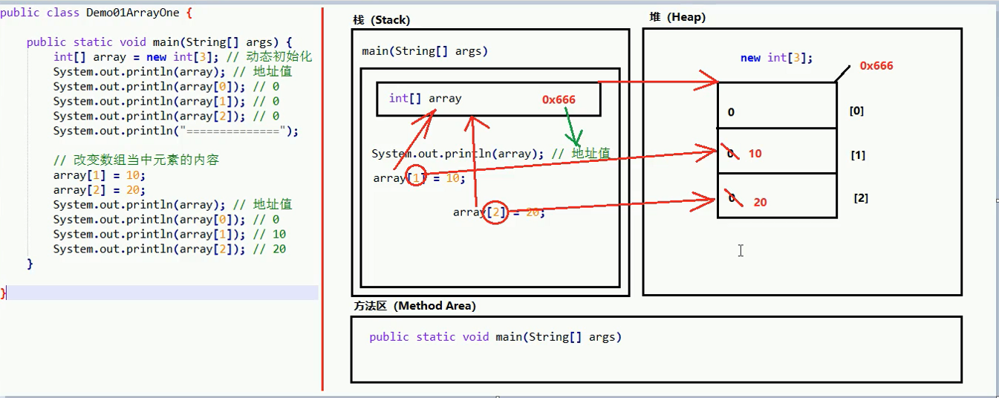

### 一. Java中的内存划分
#### java的内存需要划分成5个部分
#### 1. 栈：存放的都是方法中的局部变量。方法的运行一定要在栈中运行。
> 局部变量：方法的参数，或者是方法{}内部的变量
> 作用域：一旦超出作用于，立刻从栈内存中消失

#### 2. 堆(Heap)：凡是new出来的东西，都在对当中。
> 堆内存里的东西都有一个地址值：16进制
> 堆里存放的数据，都有默认值。规则：
>> 整数---------默认为0
>> 浮点数-------0.0
>> 字符---------'\u0000'
>> 布尔---------false
>> 引用类型-----null

#### 3. 方法区：存储.class相关的信息，包含方法的信息

#### 4. 本地方法栈：与操作系统相关

#### 5. 寄存器： 与CPU相关

### 二. 数组在内存空间的描述信息

