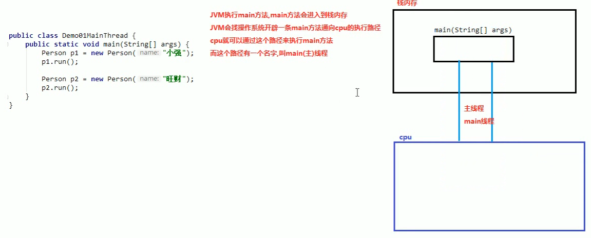

### 异常及处理

#### 1. throw关键字

> 抛出指定的异常。
>
> - 格式：`throw new XxxException("产生异常的原因");`
>
>   > **注意**:
>   >
>   > - throw关键字必须写在方法的内部
>   >
>   > - XxxException必须是Exception或者它的子类
>   >
>   > - throw抛出了异常，那么就必须要处理异常
>   >
>   >   > - 如果异常是RuntimeException类或者它的子类，那就不用处理，默认交给JVM处理
>   >   >
>   >   > - 否则必须用throws或者try...catch...处理

#### 2. Objects非空判断

> 在检验参数是否为空时，可以使用下面的方法
>
> `Objects.requireNonNull(obj)`，该方法的源码。
>
> 
>
> 例如
>
> ```java
> int getIndex(int[] arr, index) {
>     Objects.requireNonNull(arr, "传递的数组是null");
>     Objects.requireNonNull(index);
> }
> ```

#### 3. throws关键字

> 这是处理异常的第一种方法：交给别人处理
>
> - 作用：使用throws声明异常，然后交给该方法的调用者，最后交给JVM--中断处理
>
> - 使用格式：
>
> ```java
> 修饰符　返回值类型　方法名(参数列表)　throws XxxException, ....{
> throw new XxxException(".....");
> .....
> }
> ```
> - 注意：
>   1. throws关键字必须写在方法声明处
>   
>   2. throw关键字后边声明的异常必须是Exception或者其子类
>   
> 3. 方法内部如果抛出了多个异常异常对象，那么就要在throws后加几个异常对象。如果多个异常对象之间存在父子关系，则只需要声明父类异常
>   
>   4. 声明的异常要么是交给JVM处理，要么是自己写try...catch...处理
>   
> - 例子
>
> 
>

#### 4. try...catch...

> - 格式：
>
> ```java
> try {
> ....
> } catch (定义一个异常的变量，用来接受try中抛出的异常对象){
> ...
> }
> ```
>   - 注意：try 中可能会抛出多个异常对象，那么就要用多个catch来处理
>
>   - Throwable类中国定义了３个异常处理的方法
>
>    > 1. String getMessage()  返回此throwable的简短描述
>    > 2. String toString() 返回此throwable的详细消息字符串
>    > 3. void printStackTrace() JVM打印就是使用了该方法，信息是最多的。
>   
>   - 例如
>  
>
>   结果是　
>
> 

#### 5. finally

> 无论是否发生异常都会执行的代码块，不能单独使用，只能和try...catch搭配使用

### 多线程

#### 1. 线程实现方式

##### 1.1 并发和并行

> 

##### 1.2 进程的概念

> 

##### 1.3 多线程

> 

##### 1.4 线程调度

> - 分时调度
>
>   > 所有线程轮流使用CPU的使用权，平均分配每个线程占用CPU的时间
>
> - 抢占式调度
>
>   > 优先让优先级高的线程使用CPU，如果线程的优先级相同，那么会随机选择一个(线程随机)，Java使用的是抢占式调度
>

##### 1.5 主线程

> 