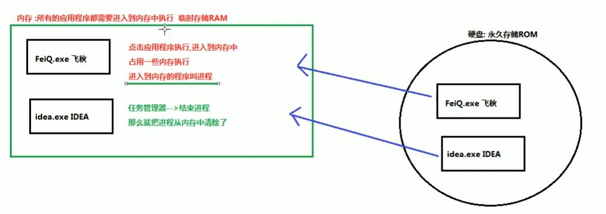
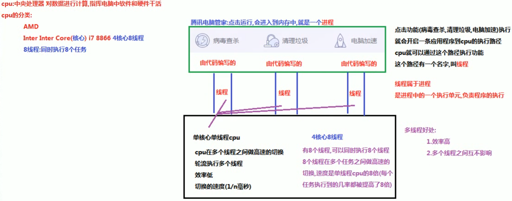
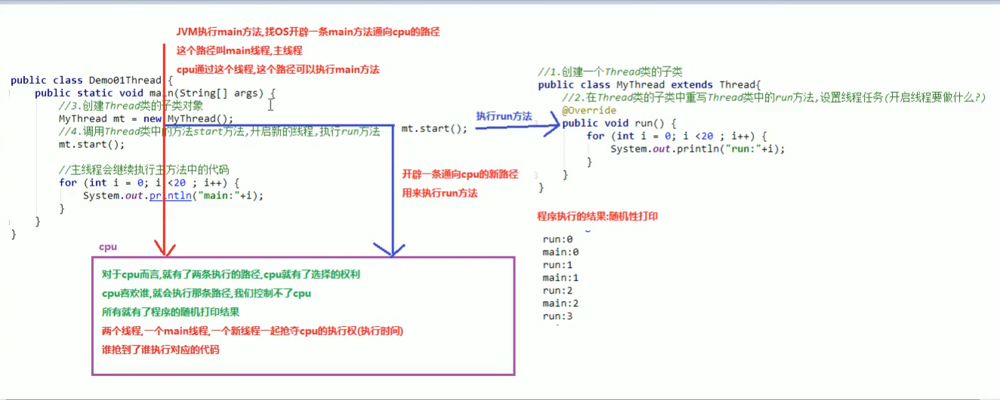
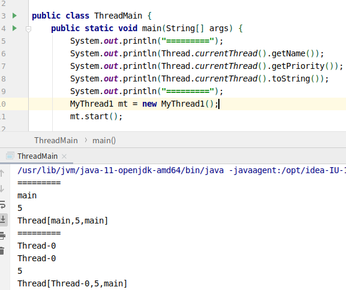

### 多线程

#### 1. 线程实现方式

##### 1.1 并发和并行

> 

##### 1.2 进程的概念

> 

##### 1.3 多线程

> 

##### 1.4 线程调度

> - 分时调度
>
>   > 所有线程轮流使用CPU的使用权，平均分配每个线程占用CPU的时间
>
> - 抢占式调度
>
>   > 优先让优先级高的线程使用CPU，如果线程的优先级相同，那么会随机选择一个(线程随机)，Java使用的是抢占式调度

##### 1.5 主线程

> 

#### 2. 创建多线程的方式

##### 1.1 第一种方式

###### 1.1.1 创建Thread类的子类

> - 实现步骤：
>   1. 创建一个Thread了的子类
>   2. 在Thread类的子类中重写Thread类中的run()方法
>   3. 创建Thread类的子类对象
>   4. 调用Thread类中的start方法，开启新的线程，执行run方法

###### 1.1.2 多线程原理

> 

###### 1.1.3 多线程在内存中的表示

> 

###### 1.1.4 一些常用方法

> - `static Thread   currentThread()` 返回对当前正在执行的线程对象的引用。
> - `String getName()` 返回该线程的名称。
> - `int getPriority()`返回线程的优先级。
> - `static void sleep(long millis)`在指定的毫秒数内让当前正在执行的线程休眠（暂停执行），此操作受到系统计时器和调度程序精度和准确性的影响。 
> - `String toString()`返回该线程的字符串表示形式，包括线程名称、优先级和线程组
> - `static void yield()`暂停当前正在执行的线程对象，并执行其他线程
>
> 

##### 1.2 第二种方式

###### 1.2.1 实现Runnable接口

> - 实现步骤
>   1. 创建一个Runnable接口的实现类
>   2. 在实现类中重写Runnable接口的run()方法，设置线程任务
>   3. 创建一个Runnable接口的实现对象
>   4. 创建一个Thread类对象，构造方法中传递Runnable接口 的实现类对象
>   5. 调用start()方法
>
> - 例如
>
>   > 创建一个Runnable类的接口MyThread2类
>   >
>   > ```java
>   > class MyThread2 implements Runnable {
>   >  @Override
>   >  public void run() {
>   >      // 这种方法里不能直接用getName()获取线程的名字
>   >      System.out.println(Thread.current().getName());
>   >  }
>   > }
>   > ```
>
> - 在main方法里使用多线程
>
> ```java
> MyThread2 mt2 = new MyThread2();
> Thread thread = new Thread(mt2);
> thread.start();
> ```

##### 1.3 两种方式的比较

###### 1.3.1 使用Runnable接口的好处

> - 避免了单继承的局限性(一个类只能继承一个父类，继承了Thread类之后，就不能继承其他类了)：实现了Runnable接口，还可以继承其他类，实现其他接口
> - 增强了程序的扩展性，降低了程序的耦合性(解耦)：
>   - 实现Runnable接口的方式，把设置线程任务和开启线程进行了分离(解耦)
>   - 实现类中重写了run()方法，设置线程任务。创建Thread方法时，因为要传入参数，所以我们可以改变传入的参数所对应的接口实现类，就可以开启不同的线程了。
>
> ```java
>  MyThread1 mt1 = new MyThread1();
>  MyThread2 mt1 = new MyThread2();
>  MyThread3 mt1 = new MyThread3();
>  Thread t = new Thread(mt1);  // 改变传入的参数，就可以改变开启的线程
>  Thread(t2).start();
>  t.start();
> ```

##### 1.4 第三种方式

###### 1.4.1 匿名内部类

> - 父类是Thread
>
> ```java
> // 父类是Thread
> new Thread() {
>    // 重写run() 方法
>    @Override
>    public void run() {
>        System.out.println("父类是Thread线程执行");
>    }
> }.start();
> 
> // 实现接口Runnable类
> Runnable r = new Runnable(){
>    @Override
>    public void run() {
>        System.out.println("实现Runnable接口线程执行");
>    }
> };
> new Thread(r).start();
> 
> // 实现接口Runnable类的简化方式
> new Thread(new Runnable() {
>    @Override
>    public void run() {
>        System.out.println("简化实现Runnable接口线程执行");
>    }
> }).start();
> ```

#### 3. 线程同步机制

#### 3.1 线程安全问题的描述

> 多个线程访问了共享数据，会产生安全问题

#### 3.2 解决线程安全问题

> 三种方式解决

##### 3.2.1 使用同步代码块

- 格式：

```java
 synchronized(锁对象) {
     可能会出现线程安全问题的代码（访问了共享资源）;
 }
```

- 注意：

1. 通过代码块中的锁对象，可以使用任意的对象。
2. 但是必须保证多个线程使用的锁对象是同一对象
3. 锁对象的作用：把同步代码块锁住，只让一个线程在同步代码块中执行

- 例如：

```java
// 实现Runnable接口来创建线程类
public class Demo implements Runnable {
    private int ticket = 100;
    Object obj = new Object();
    @Override
    public void run() {
        while (true) {
            synchronized (obj) {
                System.out.println(Thread.currentThread.getName() + "正在买票" + ticket--);
            }
        }
    }
}
```

```java
// 使用线程
Demo d = new Demo();
Thread t1 = new Thread(d);
Thread t2 = new Thread(d);
Thread t3 = new Thread(d);
t1.start();
t2.start();
t3.start();
```

- 同步技术的原理：

  > 使用了一个锁对象，这个锁对象也叫同步锁。
  >
  > 1. 多个线程一起抢夺cpu的执行权，谁抢到了，就执行run方法，遇到synchronized代码块，就会先判断是否有锁对象，如果有，就会获取到锁对象，进入到同步中执行。执行期间，别的线程就找不到该锁对象，就会进入阻塞状态，直到锁对象被归还了之后才开始执行。
  > 2. 总结：同步中的线程，没有执行完毕不会释放锁对象，同步外的线程没有锁也进不去同步。
  > 3. 缺点：因为要频繁的判断是否有锁对象，所以效率会相对较低

##### 3.2.2 同步方法

- 如何实现？

  将访问共享资源的代码提取出来，放到一个新的方法中，该方法用修饰符synchronsized来限定

  语法：

  ```java
  修饰符　synchronized　返回值类型　方法名(参数列表) {
  	访问了共享资源的代码块；
  }
  ```

- 原理和上一种方法一样，也是用了同步锁。那么这儿的同步锁对象是谁呢？就是this，即调用该方法的对象。

- 静态同步方法

- 即定义一个静态方法

  但是要注意，既然是静态方法，那么代码里的数据（比如使用的成员变量也必须是静态的）

##### 3.2.3 使用lock锁

- java.util.concurrent.locks.Lock接口

- Lock接口中的方法：

  > void lock()  获取锁；
  >
  > void unlock() 释放锁；

- 使用步骤

  1. 在成员位置创建一个ReentrantLock对象
  2. 在可能出现安全问题的代码块前调用lock()方法
  3. 在可能出现安全问题的代码块后调用unlock()方法

- 例如

  ```java
  Lock l = new ReentrantLock();
  @Override
  public void run() {
      ...
      l.lock();
      try {
          可能出现安全问题的代码块；
      } catch(...) {
          ...
      } finally {
          l.unlock();
      }
  }
  ```

  