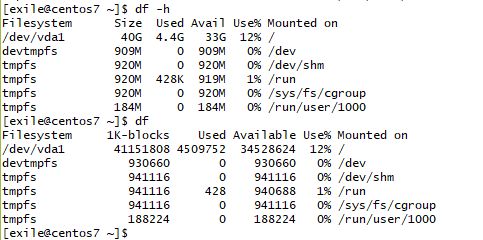

### 磁盘管理
1. df命令
> 1. 描述：检查文件系统的磁盘空间占用情况。
> 2. 语法：`df [-ahikHTm] [目录或文件名]`
> 3. 选项和参数
>> -a: 列出所有的文件系统，包括系统特有的/proc等文件系统
>> -k: 以KBytes的容量显示各文件系统
>> -m: 以MBytes的容量显示个文件系统
>> -h: 以GBytes、MBytes、KBytes等格式显示
>> -H: 以M=1000k取代M=1024K的进位方式
>> -T: 显示文件系统类型
> 4. 例如
  
>> 比较常用的是`df -hT`
>> 上面的命令显示的是所有目录下的。也可以指定某个目录，比如
   `df -ht /etc`

2. du命令
> 1. 描述：查看使用空间
> 2. 语法：`du [-ahskm] 文件或目录名称`

3. fdisk命令
> 1. 描述：fdisk是linux的磁盘分区表操作工具
> 2. 语法：`fdisk [-l] 装置名称`
> 3. 选项和参数
>> -l: 输入装置所有的分区内容，若仅有 fdisk -l 时， 则系统将会把整个系统内能够搜寻到的装置的分区均列出来。
> 4. 例如
  

4. 磁盘格式化
> 1. 描述：磁盘分割完毕后自然就是要进行文件系统的格式化，格式化的命令非常的简单，使用 mkfs（make filesystem） 命令
> 2. 语法: `mkfs [-t 文件系统格式] 装置文件名`
> 3. 选项和参数：
>> -t: 可以接文件系统格式，如ext2, ext3,vfat等
> 4. 例如：`mkfs -t ext3 /dev/hdc4`

5. 磁盘检验
> 1. fsck(file system check)用来检查和维护不一致的文件系统
> 2. 描述：若系统掉电或磁盘发生问题，可利用fsck命令对文件系统进行检查
> 3. 语法：`fsck [-t 文件系统格式] [-ACay] 装置名称`
> 4. 例如：`fsck -C -f -t ext3 /dev/hdc6`

6. 磁盘挂载与卸载
> 1. 描述：Linux的磁盘挂载使用mount命令，卸载使用unmount命令
> 2. 语法：`mount [-t 文件系统] [-L Label名] [-o 额外选项] [-n] 装载文件名 挂载点`
> 3. 例如：使用默认方式，将刚刚创建的/dev/hdc6挂载到/mnt/hdc6上
  `mkdir /mnt/hdc6`
  `mount /dev/hdc6 /mnt/hdc6`
> 4. umount语法：`umount [-fn] 装置文件名或挂载点`
