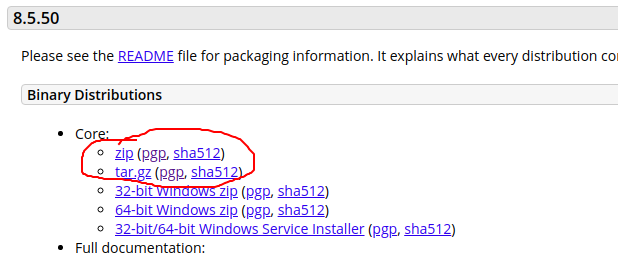

### 1. 下载tomcat8.5

下载地址：http://tomcat.apache.org


进入网址后，左边界面如上图。选择你要下载的版本，点击进入。然后选择zip或者tar.gz都可以，点击下载



### 2. 解压

先将下载的文件移动或者复制到/opt目录下。

`sudo mv apache-tomcat-8.5.50.zip /opt`，

解压：`sudo unzip apache-tomcat-8.5.50.zip`

如果下载的是tar.gz，也是一样的，先将相应的文件放到/opt下，然后解压：`tar -xvf apache-tomcat-8.5.50.tar.gz`。

### 3. 配置

#### 3.1 配置startup.sh

解压出来的目录名为apache-tomcatxxxx，为了方便，我将它重命名为tomcat。然后该目录下的内容是如下图


进入bin目录，修改startup.sh。

在最后一行`exec "$PRGDIR"/"$EXECUTABLE" start "$@"`上添加下面代码

```sh
export JAVA_HOME=/usr/lib/jvm/java-1.8.0-openjdk-amd64
export JRE_HOME=${JAVA_HOME}/jre
export PATH=${JAVA_HOME}/bin:${JRE_HOME}:$PATH
export CLASSPATH=.:${JRE_HOME}/lib/rt.jar:${JAVA_HOME}/lib/dt.jar:${JAVA_HOME}/lib/tools.jar 
export TOMCAT_HOME=/opt/tomcat/apache-tomcat-8.5.50
export CATALINA_BASE=/opt/tomcat/apache-tomcat-8.5.50
export CATALINA_HOME=/opt/tomcat/apache-tomcat-8.5.50
export CATALINA_TMPDIR=/opt/tomcat/apache-tomcat-8.5.50/temp
```

JAVA_HOME是你的java安装路径，注意，后面的TOMCAT_HOME, CATALINA_BASE什么的，路径不要写错，根据你的tomcat的路径来写。最后wq保存退出

#### 3.2 配置shutdown.sh

shutdown.sh也是一样的，在最后一行的上面添加上面的代码，保存退出。

### 4. 启动tomcat

在bin目录下，执行`sudo ./startup.sh`，如果出现下面的这个界面说明成功了，在浏览器地址栏中输入localhost:8080就可以访问了tomcat的主页了。


但是有可能会一个什么文件**没有执行权限的错误**，因为启动之后，不只是startup.sh运行，其他的一些.sh文件也会运行，所以使用命令`sudo chmod 755 *.sh`来对bin目录下的所有sh文件赋予可执行权限（当然你用`sudo chmod +x *.sh也是可以的`）。

### 5. eclipse配置tomcat服务器

依次点击Window->Show View->Servers，注意，如果你的eclipse不是eclipse for JavaEE版的，那么可能配置Web会比较麻烦，可以去安装插件。为了省事我直接安装的就是JavaEE版的。

点击完Servers之后，在下面跳出来的Servers窗口下会显示没有可用的Servers，直接点击这个它的这段话，在跳转出来的窗口中选择你的tomcat安装路径即可。

最后配置好之后，你的左边的项目目录中应该会多出一个Servers项目，如果没有，那可能是你哪一步弄错了。